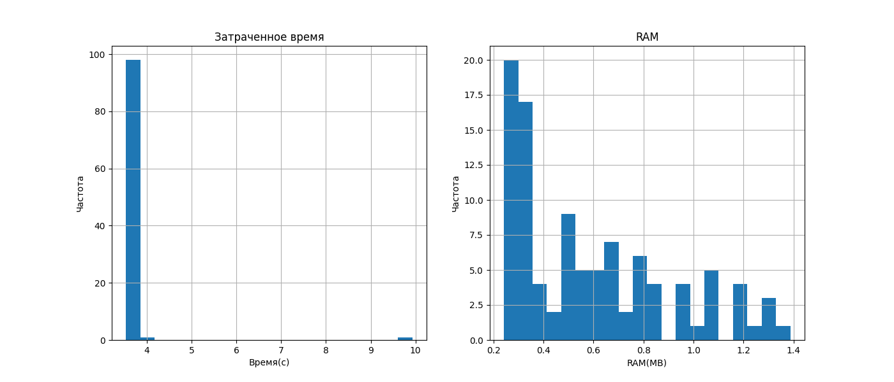
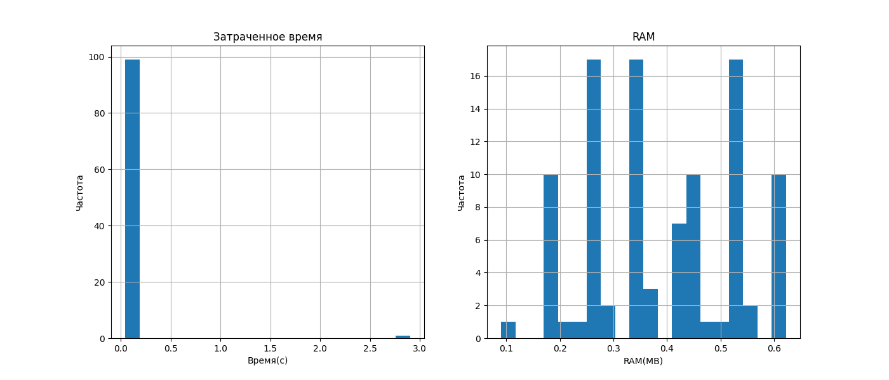
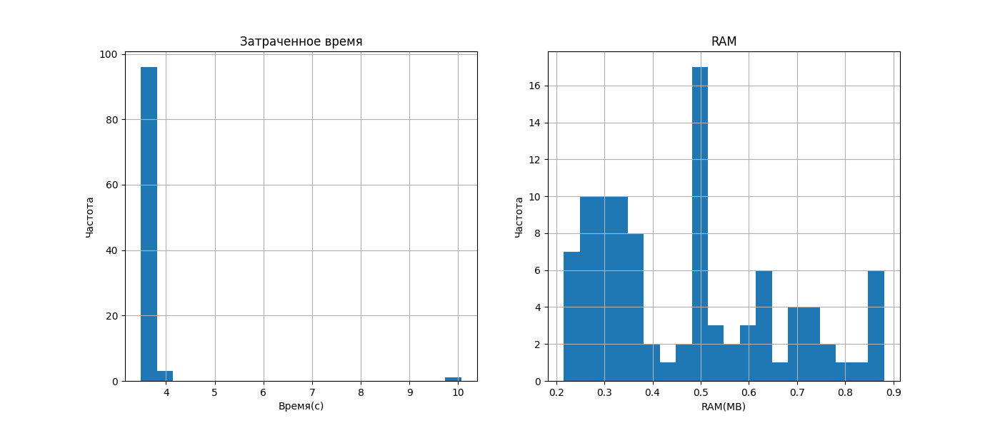
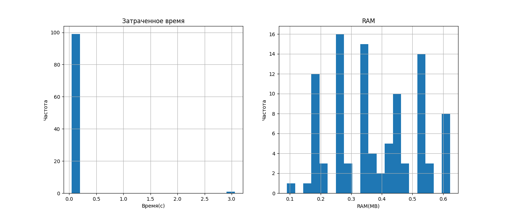

## Запуск

Датасет: https://www.kaggle.com/datasets/rupakroy/online-payments-fraud-detection-dataset/

Для запуска необходимо скачать и распоковать датасет в папку `dataset`

Также необходимо обучить модель используя `src/train_model.ipynb`

Для того чтобы запустить приложение необходимо выполнить следующие соманды:

Для приложения с 1 датанодой и без оптимизации
```
source run.sh
```

Для приложения с 1 датанодой и с оптимизации
```
source run.sh 1 optimize
```

Для приложения с 3 датанодами и без оптимизации
```
source run.sh 3
```

Для приложения с 3 датанодами и с оптимизацией
```
source run.sh 3 optimize
```

*Важно:* между запусками приложения с 1 и 3 датанодами останавливайте запущенные докеры. Например, командой `docker stop $(docker ps -q)` для отключения всех докеров. Если вы запускаете приложение с одним и тем же количеством датанод, перезапуск не требуется.

## Результаты:

1 датанода. Без оптимизации


1 датанода. C оптимизацией


3 датаноды. Без оптимизации


3 датаноды. C оптимизацией


## Вывод

Приложение с оптимизацией лучше работает с данными, в среднем используется меньшее количество памяти, распределение памяти более сбалансировано. Также снижается среднее время работы программы